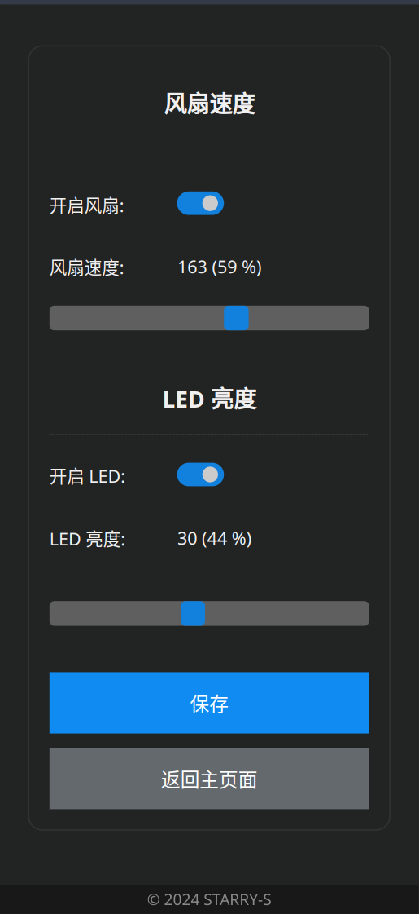

## ESP32 兽装风扇 & LED 控制器

> [English](README.md) | 简体中文

用于远程控制兽装头部的风扇 & LED 发光组件的控制器。

> 此项目基于 ESP32 PlatformIO `esp-idf`，可用于 ESP32 和 ESP32C3

### 屏幕截图

### 配置文件

可在 [data/config/config.cfg](data/config/config.cfg) 修改风扇、LED（MOSFET）和 WIFI 的配置。

除此之外还可在设置选项 UI 界面编辑查看一部分配置信息。

### LICENSE

Copyright 2024 STARRY-S

Licensed under the Apache License, Version 2.0 (the "License");
you may not use this file except in compliance with the License.
You may obtain a copy of the License at

http://www.apache.org/licenses/LICENSE-2.0

Unless required by applicable law or agreed to in writing, software
distributed under the License is distributed on an "AS IS" BASIS,
WITHOUT WARRANTIES OR CONDITIONS OF ANY KIND, either express or implied.
See the License for the specific language governing permissions and
limitations under the License.

----

> 爪子 Favation 图标源自 [fontawesome](https://fontawesome.com/icons/paw?f=classic&s=solid)，由[realfavicongenerator.net](https://realfavicongenerator.net/) 生成。
