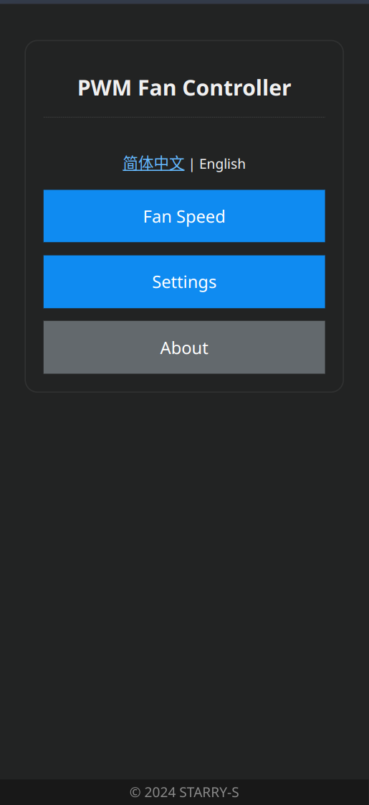
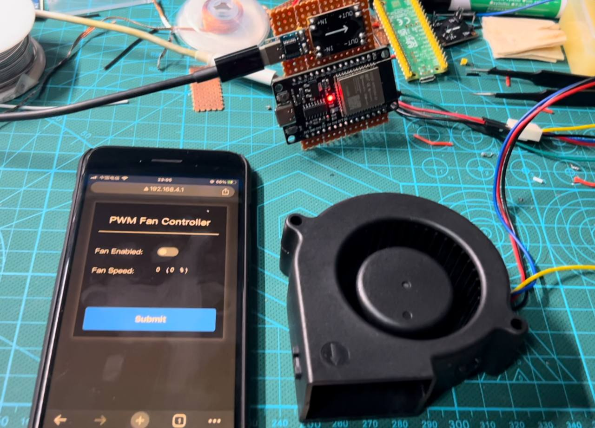

## ESP32 PWM Fan Controller

> WIP: **This project is under heavy development, the `main` is not stable yet!**

This is an esp32 PlatformIO `esp-idf` project.

PWM Fan WIFI remote controller, can be used for cooldown system.
Available to use on esp32 & esp32c3.

Just for fun.

### Web-UI

----

Currently, the WIFI and PWM GPIO are hard-coded in [main.c](/src/main.c#L18). 
The editable configuration web UI interface is currently working in progress 
and will be coming soon.

> The paw favicon icon is from [fontawesome](https://fontawesome.com/icons/paw?f=classic&s=solid), generated by [realfavicongenerator.net](https://realfavicongenerator.net/),.

### LICENSE

Copyright 2024 STARRY-S

Licensed under the Apache License, Version 2.0 (the "License");
you may not use this file except in compliance with the License.
You may obtain a copy of the License at

http://www.apache.org/licenses/LICENSE-2.0

Unless required by applicable law or agreed to in writing, software
distributed under the License is distributed on an "AS IS" BASIS,
WITHOUT WARRANTIES OR CONDITIONS OF ANY KIND, either express or implied.
See the License for the specific language governing permissions and
limitations under the License.
