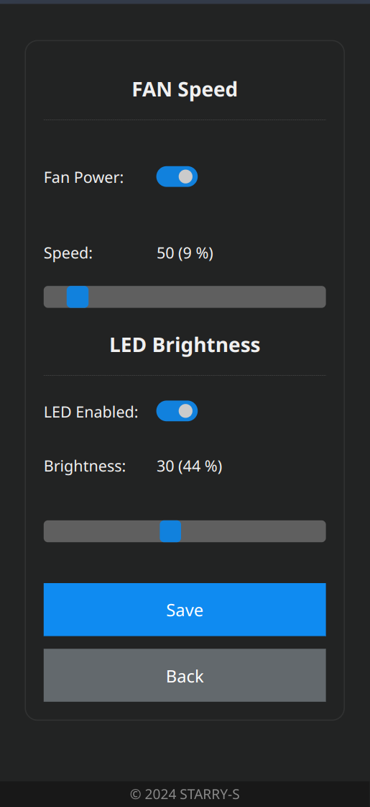
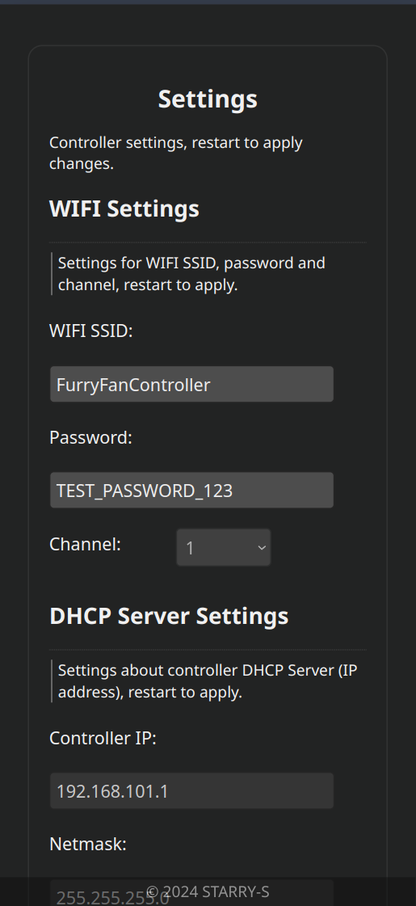

## ESP32 Fursuit Fan & LED Remote Controller

> English | [简体中文](README.cn.md)

ESP32 PlatformIO `esp-idf` project for remote control of PWM fan speed & LED brightness.

For fursuit head cooling system and LED decorations.

> This project is available to use for esp32 & esp32c3.

### Screenshots

### Configuration

Config file for PWM, LED (MOSFET), Wifi in located in [data/config/config.cfg](data/config/config.cfg).

The settings web UI allows user to view & edit some configurations.

### LICENSE

Copyright 2024 STARRY-S

Licensed under the Apache License, Version 2.0 (the "License");
you may not use this file except in compliance with the License.
You may obtain a copy of the License at

http://www.apache.org/licenses/LICENSE-2.0

Unless required by applicable law or agreed to in writing, software
distributed under the License is distributed on an "AS IS" BASIS,
WITHOUT WARRANTIES OR CONDITIONS OF ANY KIND, either express or implied.
See the License for the specific language governing permissions and
limitations under the License.

----

> The paw favicon icon is from [fontawesome](https://fontawesome.com/icons/paw?f=classic&s=solid), generated by [realfavicongenerator.net](https://realfavicongenerator.net/).
